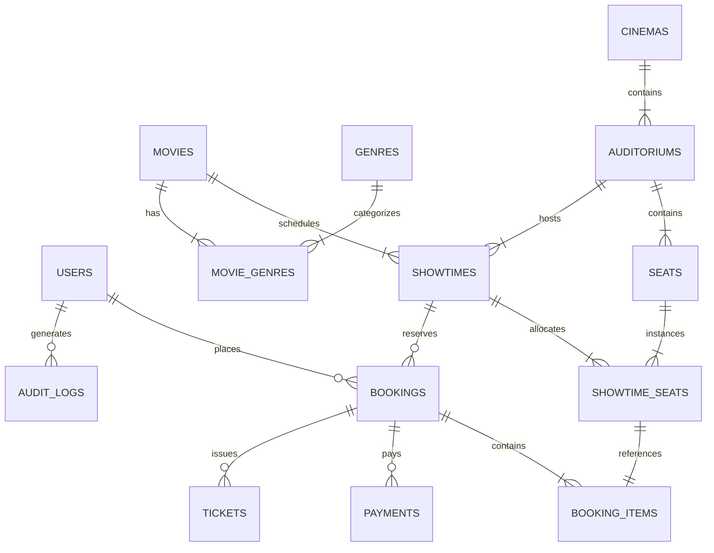

# CineBook 🎬 — Production Cinema Ticket-Booking Platform

**CineBook** is a production-ready, full-stack cinema ticket-booking web application built with **Next.js (App Router, TypeScript)**, **Tailwind CSS**, **Neon Serverless PostgreSQL**, and **Drizzle ORM**, configured for immediate deployment on **Vercel**.

Designed and built collaboratively by three specialized agents:
- **Agent 1: App Agent** — Responsive luxury cinema dark interface, search & filter dock, interactive seat maps, price tally, test-mode payment gateway, digital boarding pass tickets with scannable QR codes, customer booking history with cancellation, and admin operations dashboard.
- **Agent 2: Database Engine Agent** — 14 PostgreSQL tables with UUID primary keys, UTC timestamps, money stored strictly as integer minor units (cents), unique constraints, row-level locking booking transactions, and a CRON-protected seat hold sweeper.
- **Agent 3: QA Agent** — Comprehensive automated verification suite verifying concurrent seat reservation race conditions, hold expiration sweeps, payment idempotency, IDOR security barriers, and production Next.js builds.

---

## 🌟 Key Features

1. **Rich Cinematic Aesthetic**:
   - Deep obsidian (`#06080F`), metallic slate, electric amber, and glowing cinema accents.
   - Curved cinema screen layout with realistic auditorium illumination.
   - Distinct seat classifications: Standard, Premium, VIP Recliners, and Accessible.
   - Live hold expiration countdown timer banner (10 minutes).
2. **High-Concurrency Booking Transaction Engine**:
   - Atomic database transactions with row-level locks (`FOR UPDATE`).
   - Pessimistic concurrency control preventing duplicate seat holds across competing sessions.
   - Automatic expiration and release of unpurchased seat holds via Vercel Cron (`CRON_SECRET`).
3. **Payment Processing with Idempotency**:
   - Test-mode payment gateway with 1-click test card auto-fill.
   - Idempotency-Key support preventing duplicate charges or duplicate ticket issuance on network retries.
4. **Digital Pass & QR Code Generation**:
   - Boarding-pass cinema tickets with perforated cutout edges.
   - Server-side dynamically generated 256-bit QR codes with encrypted booking verification data.
   - Integrated print and wallet actions.
5. **Customer Self-Service & Cancellation**:
   - View past and upcoming screenings with status badges (`CONFIRMED`, `PENDING`, `CANCELLED`, `REFUNDED`, `EXPIRED`).
   - Automated 2-hour policy cancellation: releases seats back to `AVAILABLE` and triggers refund simulation.
6. **Admin Operations Portal**:
   - Real-time KPI metrics: Total Revenue ($), Total Bookings, Active Showtimes, Registered Patrons.
   - Manual sweep trigger for expired seat holds.
   - Recent booking transaction logs.

---

## 🏗️ Architecture & Database Schema

CineBook uses **Drizzle ORM** with **Neon Serverless PostgreSQL**. All primary keys use `gen_random_uuid()`, all money is in integer minor units (cents), and timestamps are stored in UTC.



### The 14 Tables:
1. `users`: UUID PK, name, email (unique), passwordHash, role (`USER` | `ADMIN`), phone, timestamps.
2. `movies`: UUID PK, title, slug (unique), synopsis, posterUrl, backdropUrl, trailerUrl, durationMinutes, releaseDate, language, rating, status (`NOW_SHOWING` | `COMING_SOON` | `ARCHIVED`).
3. `genres`: UUID PK, name (unique), slug (unique).
4. `movie_genres`: Composite PK (`movieId`, `genreId`), FKs with cascade deletion.
5. `cinemas`: UUID PK, name, slug (unique), address, city, state, postalCode, phone, amenities (JSONB), imageUrl.
6. `auditoriums`: UUID PK, cinemaId FK, name, screenType (`STANDARD` | `IMAX` | `DOLBY_CINEMA` | `VIP_LOUNGE`), totalSeats. **UNIQUE constraint: `(cinemaId, name)`**.
7. `seats`: UUID PK, auditoriumId FK, rowIdentifier, seatNumber, seatType, priceTier, posX, posY. **UNIQUE constraint: `(auditoriumId, rowIdentifier, seatNumber)`**.
8. `showtimes`: UUID PK, movieId FK, auditoriumId FK, startTime (UTC), endTime (UTC), basePriceCents, status (`SCHEDULED` | `ACTIVE` | `COMPLETED` | `CANCELLED`).
9. `showtime_seats`: UUID PK, showtimeId FK, seatId FK, status (`AVAILABLE` | `HELD` | `BOOKED` | `BLOCKED`), heldUntil (UTC), heldByUserId FK, bookingId FK, version integer. **UNIQUE constraint: `(showtimeId, seatId)`**.
10. `bookings`: UUID PK, bookingReference (unique), userId FK, showtimeId FK, status (`PENDING` | `CONFIRMED` | `CANCELLED` | `EXPIRED` | `REFUNDED`), subtotalCents, serviceFeeCents, taxCents, totalCents, currency, idempotencyKey (unique), expiresAt (UTC).
11. `booking_items`: UUID PK, bookingId FK, showtimeSeatId FK (unique), seatPriceCents.
12. `payments`: UUID PK, bookingId FK, paymentIntentId (unique), paymentProvider, status (`PENDING` | `SUCCEEDED` | `FAILED` | `REFUNDED`), amountCents, currency, paymentMethod, idempotencyKey (unique).
13. `tickets`: UUID PK, bookingId FK, ticketCode (unique), qrCodeData, seatSummary, status (`VALID` | `USED` | `CANCELLED`), issuedAt.
14. `audit_logs`: UUID PK, userId FK, action, entityType, entityId, details (JSONB), ipAddress, userAgent, createdAt.

---

## ⚡ Concurrency & Booking Transaction Rules

1. **Transaction Initiation**: A database transaction starts with `BEGIN`.
2. **Row Locking**: Requested `showtime_seats` records are acquired with `FOR UPDATE`.
3. **Availability Confirmation**: Every seat is confirmed `AVAILABLE` (or previously held by the current user within expiry).
4. **Temporary Seat Hold**: Status transitions to `HELD` with an expiration timestamp (`now() + 10 minutes`).
5. **Server-Side Price Calculation**: Subtotal, service fee ($1.50/seat), and tax (8%) are computed strictly on the backend.
6. **Pending Booking Creation**: Inserted with unique booking reference (`CB-XXXXXX`) and idempotency key.
7. **Commit**: Transaction commits atomically.
8. **Payment Confirmation**: Upon test or live payment webhook confirmation, seats transition to `BOOKED` and encrypted digital tickets are generated.
9. **Automatic Hold Release**: Endpoint `/api/cron/release-holds` runs every 2 minutes (protected with `CRON_SECRET`) releasing expired holds idempotently back to `AVAILABLE`.

---

## 🚀 Getting Started Locally

### Prerequisites
- Node.js 18+ (tested on Node v24)
- npm 9+

### 1. Install Dependencies
```bash
npm install
```

### 2. Configure Environment Variables
Copy `.env.example` to `.env.local`:
```bash
cp .env.example .env.local
```

| Variable | Description |
|---|---|
| `DATABASE_URL` | Neon pooled connection string for application requests |
| `DATABASE_URL_UNPOOLED` | Neon direct unpooled connection string for migrations |
| `JWT_SECRET` | Secret key for JWT session cookies |
| `CRON_SECRET` | Bearer token protecting the `/api/cron/release-holds` endpoint |
| `NEXT_PUBLIC_APP_URL` | Application root URL (`http://localhost:3000`) |
| `STRIPE_SECRET_KEY` | Optional test API key for Stripe |

> **Offline/Local Development**: CineBook includes a dual connection engine with an in-memory test store fallback, so you can test all UI workflows, seat maps, and tests locally even before provisioning remote Neon credentials.

### 3. Generate & Run Database Migrations
```bash
# Generate SQL migration files from Drizzle schema
npm run db:generate

# Execute migrations against Neon PostgreSQL
npm run db:migrate

# Seed sample movies, cinemas, auditoriums, seats, and showtimes
npm run db:seed
```

### 4. Run Automated QA Tests
```bash
npm run test:all
```

Runs the full QA verification suite:
- `auth.test.ts`: Password hashing, JWT claims, role authorization.
- `concurrency.test.ts`: Simultaneous seat-booking race condition assertion (verifying exactly 1 winner and 1 409 conflict).
- `hold-expiration.test.ts`: Expired seat hold sweeper verification.
- `payment-idempotency.test.ts`: Idempotency key duplicate replay protection.
- `idor-security.test.ts`: Cross-user cancellation barrier and owner authorization.

### 5. Start Development Server
```bash
npm run dev
```
Open [http://localhost:3000](http://localhost:3000) in your browser.

---

## 🔑 Demo Credentials

To test customer and admin capabilities instantly with 1 click:

- **Customer Demo**:
  - Email: `viewer@cinebook.com`
  - Password: `ViewerPass123!`
  - Role: Regular customer (browse, hold seats, checkout, view passes, cancel).

- **Administrator Demo**:
  - Email: `admin@cinebook.com`
  - Password: `AdminPass123!`
  - Role: Cinema Admin (access to `/admin` dashboard, analytics, manual hold release trigger).

---

## 🚢 Deploying to Vercel

1. **Push to GitHub**:
   ```bash
   git init
   git add .
   git commit -m "feat: CineBook production cinema platform"
   git branch -M main
   git remote add origin <your-github-repo-url>
   git push -u origin main
   ```

2. **Import into Vercel**:
   - Go to [Vercel Dashboard](https://vercel.com/new).
   - Import your CineBook repository.

3. **Provision Neon PostgreSQL via Vercel Marketplace**:
   - In your Vercel Project settings or Marketplace tab, select **Neon Serverless Postgres**.
   - Vercel will automatically populate `DATABASE_URL` and `DATABASE_URL_UNPOOLED` in your Environment Variables.

4. **Add Environment Variables**:
   In Vercel Project Settings -> Environment Variables, configure:
   - `JWT_SECRET`: Random 32+ character string.
   - `CRON_SECRET`: Random alphanumeric string matching `vercel.json`.
   - `NEXT_PUBLIC_APP_URL`: Your Vercel production domain (e.g. `https://cinebook.vercel.app`).

5. **Deploy**:
   - Click **Deploy**. Vercel will run `npm run build` and automatically configure the Cron job defined in `vercel.json` (`*/2 * * * *` on `/api/cron/release-holds`).
   - Run `npm run db:migrate` and `npm run db:seed` against your production Neon instance using Vercel CLI or migration runner.

---

## 🛡️ Security & Best Practices

- **Never Expose Database Secrets**: Database queries and connection poolers execute strictly inside Vercel Serverless Functions.
- **HTTP-Only Session Cookies**: JWT sessions are stored with `httpOnly: true`, `secure: true`, and `sameSite: lax`.
- **CRON Route Authentication**: The hold sweeper strictly rejects requests lacking the `CRON_SECRET` bearer header or query secret.
- **IDOR Protection**: All cancellation and ticket retrieval endpoints verify that the authenticated user ID matches the booking owner ID.
